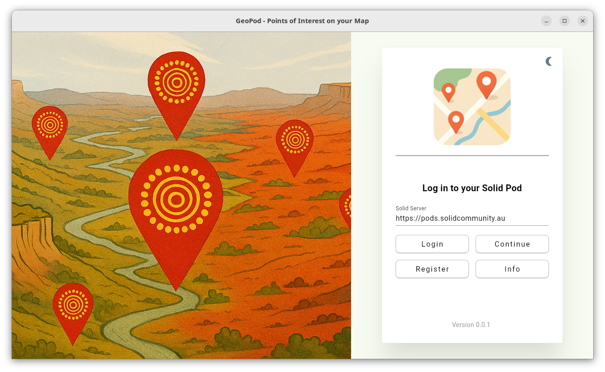

# GeoPod

[](https://flutter.dev)
[](https://dart.dev)

[](https://github.com/gjwgit/geopod)
[](https://github.com/gjwgit/geopod?tab=GPL-3.0-1-ov-file)
[](https://github.com/gjwgit/geopod/blob/dev/CHANGELOG.md)
[](https://github.com/gjwgit/geopod/commits/dev/)
[](https://github.com/gjwgit/geopod/commits/dev/)
[](https://github.com/gjwgit/geopod/issues)
[](https://github.com/gjwgit/geopod/actions/workflows/installers.yaml)

GeoPod is a [solidui](https://github.com/anusii/solidui) based
demonstrator app utilising a map-based interface to location oriented
data. Location data is stored in your own encrypted personal online
datastore (Pod) hosted in your Data Vault on a [Solid
Server](https://solidproject.org/about). The location based data is
displayed through a map interface. The points of interest represented
as locations are shared with a user of the app through secure,
private, encrypted Solid Pods by the custodian of the
knowledge. Within the map interface when a point of interest is tapped
the data/text associated with that point is displayed. The app was
developed by the [ANU Software Innovation
Institute](https://sii.anu.edu.au) and written by [Graham
Williams](https://github.com/gjwgit).

If you appreciate the app then please show some ❤️ and star the [GitHub
Repository](https://github.com/gjwgit/geopod) to support the
project.

The latest version of the app can be run online at
[geopod.solidcommunity.au](https://geopod.solidcommunity.au) with no
installation required, or downloaded and installed for your platform
from the [Solid Community AU](https://solidcommunity.au) repository:

+ **Web**
  [solidcommunity](https://geopod.solidcommunity.au/);
+ **GNU/Linux**
  [deb](https://solidcommunity.au/installers/geopod_amd64.deb) or
  [zip](https://solidcommunity.au/installers/geopod-dev-linux.zip);
+ **Windows**
  [zip](https://solidcommunity.au/installers/geopod-dev-windows.zip) or
  [inno](https://solidcommunity.au/installers/geopod-dev-windows-inno.exe).

Contributions are welcome. Visit
[github](https://github.com/gjwgit/geopod) to submit an issue or, even
better, fork the repository yourself, update the code, and submit a
Pull Request. The app is implemented in [Flutter](https://flutter.dev)
using [solidpod](https://pub.dev/packages/solidpod) for Flutter to
manage the Solid Pod interactions. Thank you.

## Introduction

Currently as of 20251121 the app utilises the
[solidui](https://pub.dev/packages/solidui) package to log into a
solid server and to provide the scaffolding for the app. Once logged
in you are presented with a simple map interface. Once Pods are
incorporated the app will retrieve points of interest that you have
access to through your Pod.




## MacOS/iOS

This project uses a human readable `project.yml` in macos and ios folders, where Xcode build configuration files are generated automatically with `xcodegen generate`. To alter the build configuration for macos or ios, edit `project.yml` in macos/ios folder, re-run xcodegen to generate updated build configuration and update native pods with `pod install`, before building or running the flutter app. The script `update_project.sh` performs these steps and aligns Podfile with Xcode build config, so after a build config change, do:

```bash
bash update_project.sh [macos/ios]
flutter run [--debug -d macos]
```

<!-- markdownlint-disable MD036 -->
*Time-stamp: <Friday 2025-11-21 19:19:17 +1100 Graham Williams>*
<!-- markdownlint-enable MD036 -->

<!-- markdownlint-disable MD053 -->
[comment]: # (Local Variables:)
[comment]: # (time-stamp-line-limit: -8)
[comment]: # (End:)
<!-- markdownlint-enable MD053 -->
